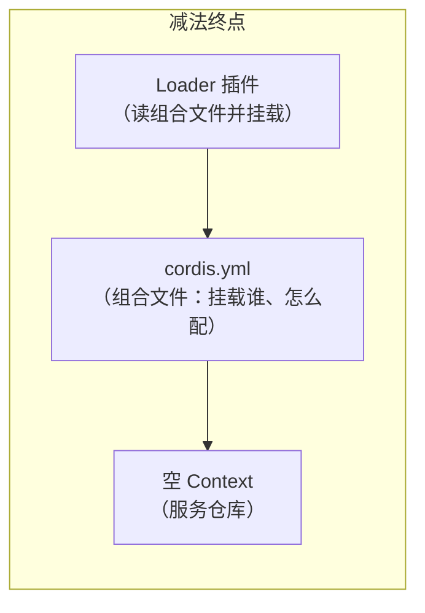

# 00 · 减法：从完整产品到插件框架

[← 总览](README.md) · 下一篇：[01 · 插件框架](01-插件框架.md)

这一篇不动手写代码，只做一件事：**把完整的 DeepSeek Harness 一层层剥掉**，看看最后剩下什么。理解"能减到什么程度"，是理解"如何逐层叠加"的前提。

## 起点：一个完整产品有多大

以 `headless` profile（命令行一次性任务模式）为例，它启动时挂载的插件行数：

```sh
pnpm dsh --profile headless --dump-config | grep -c '^- id:'
# 95
```

95 行插件，背后是 `packages/` 下 60+ 个包。画出它的轮廓（按职责分组，完整图见 [apps/cli/composition.md](../apps/cli/composition.md)）：

```mermaid
flowchart TB
  subgraph 完整 headless 产品（95 行插件）
    direction TB
    A["应用外壳<br/>headless-startup · headless-runner"]
    B["代理增强<br/>subagent · compaction · skill · todo · goal · plan-mode<br/>workflow · web 工具 · jobs · mcp · ralph · spill"]
    C["持久化与存储<br/>session-persistence-jsonl · storage × 3<br/>attachment · session-query · 投影缓存"]
    D["执行能力<br/>subprocess · sandbox × 2 · approval · permission<br/>fs-sandbox · tool-bash · tool-fs · shell-env"]
    E["代理内核<br/>agent · agent-loop · llm × 适配器 · session<br/>system-prompt · tools · llm-retry"]
    F["框架与设施<br/>cordis · loader · include · timer · hmr · telemetry"]
    A --> B --> C --> D --> E --> F
  end
```

## 第一刀：砍掉应用外壳

Web 界面、桌面端、SDK 服务器、ACP 桥接——这些只是"入口形态"。砍掉它们，剩下的 `dsh-base` 仍然是一个完整的 Agent 内核。

> 对应全景图的 ⑨ 层。四种外壳（web / headless / sdk / acp）共享同一个 base，见第 10 篇。

## 第二刀：砍掉增强与能力

再砍掉子代理、压缩、技能、待办、网页工具（⑧）、持久化（⑦）、沙箱与执行（⑥）……还能继续对话吗？**能。** 官方用一个真实发布的 profile 证明了这一点——`sdk-minimal`，它不套 base，而是显式列出一棵自足的小树：

```sh
pnpm dsh --profile sdk-minimal --dump-config | grep -c '^- id:'
# 32
```

它的补丁文件里有一句直白的注释（[packages/bundle/sdk-minimal/cordis.patch.yml](../packages/bundle/sdk-minimal/cordis.patch.yml)）：

> *Keep the minimal agent kernel explicit: unlike dsh-base, this profile owns each service row and omits every optional producer it does not use.*

这棵小树里的"最小 Agent 内核"只有九行：

```yaml
- id: timer          # '@deepseek-ai/cordis-plugin-timer'
- id: llm            # '@deepseek-ai/dsh-llm'          —— ① 模型抽象
- id: session        # '@deepseek-ai/dsh-session'      —— ② 会话日志
- id: system-prompt  # '@deepseek-ai/dsh-system-prompt' —— ③ 提示词装配
- id: tools          # '@deepseek-ai/dsh-tools'         —— ④ 工具注册表
- id: agent          # '@deepseek-ai/dsh-agent'         —— ⑤ Agent 句柄
- id: llm-retry      # '@deepseek-ai/dsh-llm-retry'
- id: jobs           # '@deepseek-ai/dsh-jobs-local'
- id: agent-loop     # '@deepseek-ai/dsh-agent-loop'    —— ⑤ 循环驱动
```

（其余行是 SDK 服务器、bash 工具、沙箱和不变量检查等。）这就是我们加法路线的 ①~⑤ 层——也是为什么第 6 篇结束时你会拥有一个真正能对话的 Agent。

## 第三刀：砍掉整个 Harness

把 `packages/` 全部拿掉，最后剩下的是 `vendor/cordis/src/` 里的 **9 个源文件**：

```text
vendor/cordis/src/
├── context.ts    # Context：服务仓库 + 插件挂载点
├── events.ts     # 五种事件派发模式
├── fiber.ts      # 插件生命周期（加载/卸载/effect 回滚）
├── registry.ts   # 插件注册表
├── service.ts    # Service 基类：把能力挂到 ctx.<key>
├── reflect.ts    # 服务可见性与依赖追踪
├── logger.ts     # 日志
├── utils.ts      # 小工具
└── index.ts      # 出口
```

**注意：这里没有 `main()`，没有 Agent，没有"模型"的概念。** 减到最后，剩下的不是一个程序，而是一个**空的应用容器**：一个根 `Context`，外加一份声明"挂载哪些插件"的组合文件。



## 这一刀砍出的三个关键认识

1. **没有特权核心。** Agent 循环、工具注册表、模型适配器和你的 hello-world 插件地位完全平等——都是挂在 `ctx` 上的插件。所以"扩展 Harness"不是改框架，而是**在旁边再挂一个插件**。
2. **每一层都能干净卸下**，因为所有注册都是可逆的 effect：插件卸载时，它注册的服务、监听器、配置全部自动回滚（第 1 篇详述）。
3. **组合文件就是产品定义。** 95 行与 32 行的差别不在代码，而在 `cordis.patch.yml`。换一个产品形态 = 换一份组合。

## 动手：亲眼看看三刀

```sh
# 第一刀前后：完整 headless（95 行）
pnpm dsh --profile headless --dump-config | grep -c '^- id:'

# 第二刀后：官方最小树（32 行）
pnpm dsh --profile sdk-minimal --dump-config | grep -c '^- id:'

# 自己动第三刀：用 overlay 把「代理增强」整层禁用
pnpm dsh --profile headless \
  --patch learn/examples/03-overlays/subtract.yml \
  --dump-config | grep -B2 'disabled: true' | grep '^- id: subagent$'
# - id: subagent   ← 行还在账本上，但标记为禁用
```

注意最后一个细节：**减法不是删行，而是禁用**。补丁层从不改写下层文件，只在账本上加一条注记——这正是"可逆、可补丁"的组合哲学，第 10 篇会完整讲。

## 小结

| 阶段 | 插件行数 | 还剩什么 |
|---|---|---|
| 完整 headless | 95 | 完整产品 |
| sdk-minimal | 32 | 最小 Agent 内核 + SDK 外壳 |
| 纯 Cordis | 0（9 个源文件） | 空 Context + 组合机制 |

减法做完了。接下来反向走一遍加法：从 0 行插件开始，一层一层加回 95 行，每一层都讲清楚它解决什么问题。

下一篇：[01 · 插件框架](01-插件框架.md)
