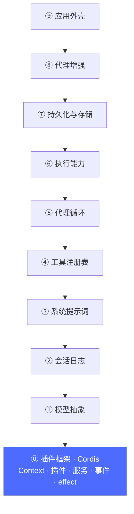
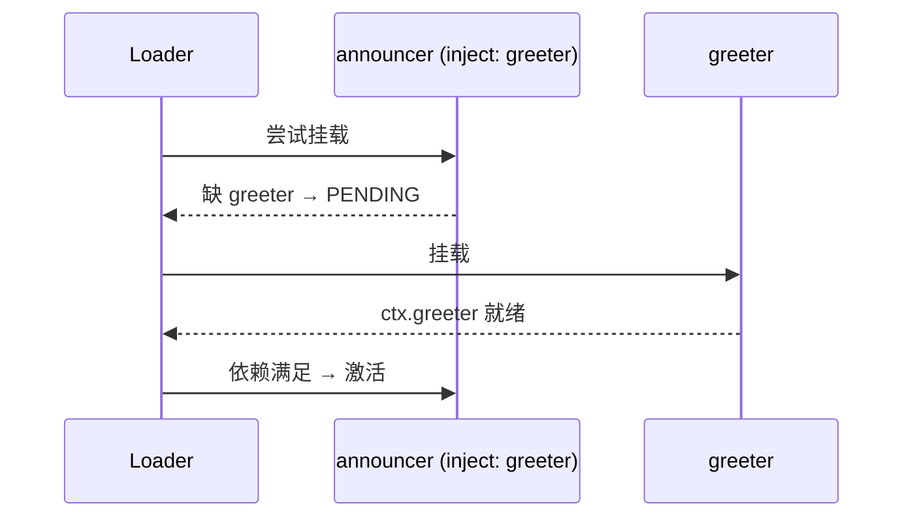
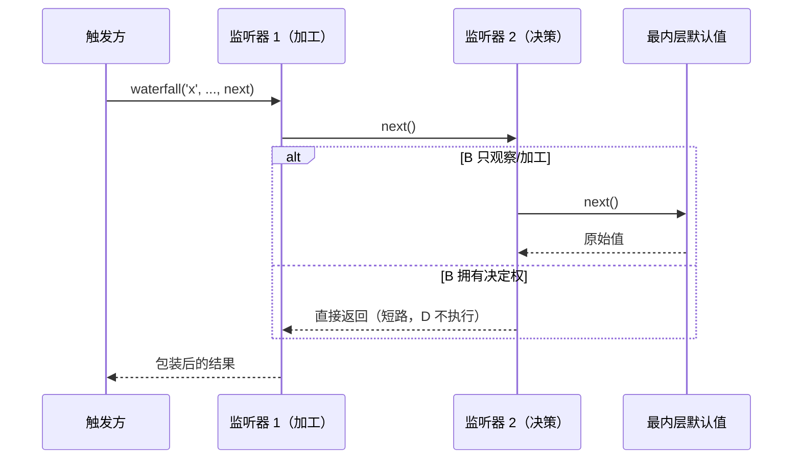
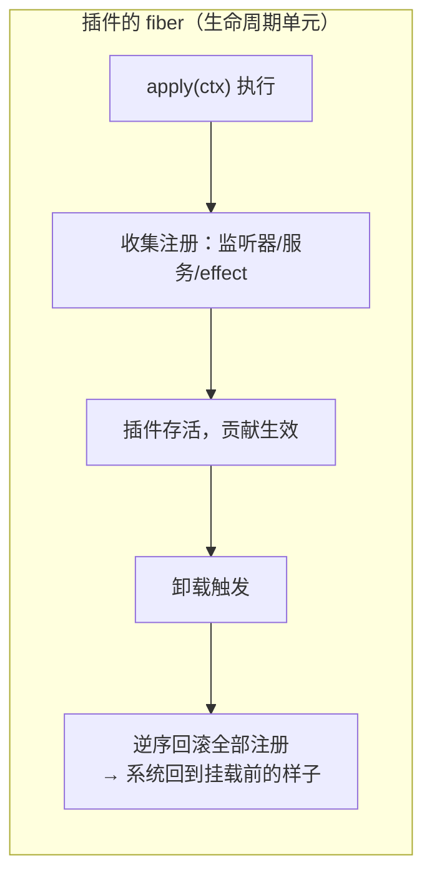

# 01 · 插件框架：Cordis 的五个概念

上一篇：[00 · 减法](00-减法.md) · 下一篇：[02 · 模型抽象层](02-模型层.md)



减法减到终点，就是这一层。整个 Cordis 只有五个核心概念，后面八层全部是它们的排列组合。

## 概念一：插件 = 一个实现 `apply(ctx)` 的单元

插件有三种形态：函数、带 `apply` 方法的对象、`Service` 子类。最常见的是函数：

```ts
export function apply(ctx: Context) {
  console.log('hello')
}
```

没有框架启动代码、没有基类强制要求——**插件描述"我贡献什么"，组合文件决定"挂谁"**。

```sh
cd learn/examples/01-bare-framework
node --import tsx ../../../vendor/cordis/bin.js
# 你好，只剩插件框架的世界！
```

bin.js 做的事情只有三件：创建根 `Context` → 挂载 Loader 插件 → Loader 读取当前目录的 `./cordis.yml` 并挂载里面列出的每个插件。

## 概念二：Context = 服务仓库

`ctx` 是所有插件共享的上下文。服务就是一个插件以稳定键名（如 `ctx.tools`、`ctx.llm`）挂上去的能力，其他插件**按键名而不是按实现**来消费它：


消费方从不 `import` 提供方——这就是为什么换一个服务实现只需要改一行配置（第 2 篇的模型适配器、第 7 篇的沙箱后端都是如此）。TypeScript 层面的 `ctx.greeter` 类型来自**声明合并**（`declare module '@deepseek-ai/cordis'`），它只影响编译期，不产生运行时代码。

## 概念三：inject = 用依赖表达顺序

`cordis.yml` 里的行顺序**没有**加载语义。想表达"我等它"，用 `inject`：

```ts
export const inject = ['greeter']  // greeter 可用前，本插件停在 PENDING
```



而且 `inject` 是**持续追踪**的：运行中服务消失（提供方被卸载/热替换），所有依赖它的插件会先被卸载；服务回来后它们再重新激活。配合下面的 effect，这保证了消费者永远不会持有失效服务的引用。

## 概念四：事件 = 五种派发模式

服务支持直接调用；事件让插件"广播事实而不知道谁在听"。五种模式的区别在于：是否等待、是否有返回值、是否短路：

| 模式 | 调用 | 语义 |
|---|---|---|
| `emit` | `ctx.emit(name, ...)` | 同步广播，不等、不收集返回值 |
| `parallel` | `await ctx.parallel(name, ...)` | 全部监听器并发执行，一起等待 |
| `serial` | `await ctx.serial(name, ...)` | 按序执行，第一个非空返回值胜出并终止 |
| `bail` | `ctx.bail(name, ...)` | serial 的同步版 |
| `waterfall` | `await ctx.waterfall(name, ..., next)` | 环绕中间件：加工 `next()` 的结果，或不调 `next()` 直接短路 |

waterfall 是 Harness 里"拦截与决策"的主力（`agent/request`、`tools/pre-execute`、`llm/stream` 都是它）：



**纪律：只观察/标注的监听器必须调 `next()`。** 忘记它会静默吞掉下游所有人的默认行为——这是本仓库的一条成文规则。

## 概念五：注册即 effect，卸载即回滚

`ctx.on()`、`ctx.plugin()`、服务注册……全部是 **effect**：插件卸载时，它在本次挂载期间收集的所有注册**逆序自动回滚**。也可以手动收集一段逻辑：

```ts
ctx.effect(() => {
  const timer = setInterval(tick, 1000)
  return () => clearInterval(timer)  // 返回的函数就是"回滚"
})
```



这就是为什么减法可行（禁用一层，其贡献消失得干干净净）、热重载可行（重挂一遍即可），也是"注册是可逆的"这条总原则的来源。

## 动手：跑通五个概念

```sh
cd learn/examples/02-services-events
node --import tsx ../../../vendor/cordis/bin.js
```

实际输出（顺序体现了"emit 在 greet 返回之前广播"）：

```text
[启动] announcer 已挂载
[事件] 刚刚问候了 世界
『你好，世界！』
[事件] 刚刚问候了 Cordis
『你好，Cordis！』
[事件] 刚刚问候了 加班的方案
『今天不聊这个。』
```

对照源码找一找：服务注册（`super(ctx, 'greeter')`）、`inject`、声明合并、waterfall 的加工与短路、两个 effect。最后一句 `『今天不聊这个。』` 是监听器 2 短路后又被监听器 1 加边框的结果。

**两个进阶实验**：① 交换 `cordis.yml` 里三行的顺序再跑——输出不变（顺序由 inject 决定）；② 把 `greeter.ts` 那行删掉再跑——消费者永远 PENDING，进程静默退出（不报错、不半启动）。

## 想更深入

- 动手教程：[docs/cordis-tutorial/](../docs/cordis-tutorial/index.zh.md)（7 章，每章可运行）
- 概念参考：[docs/cordis-primer.zh.md](../docs/cordis-primer.zh.md)
- 框架源码：`vendor/cordis/src/`（9 个文件，读完约一小时）

框架层到此为止——此刻的世界里还没有"模型"。下一篇给它加上。

下一篇：[02 · 模型抽象层](02-模型层.md)
