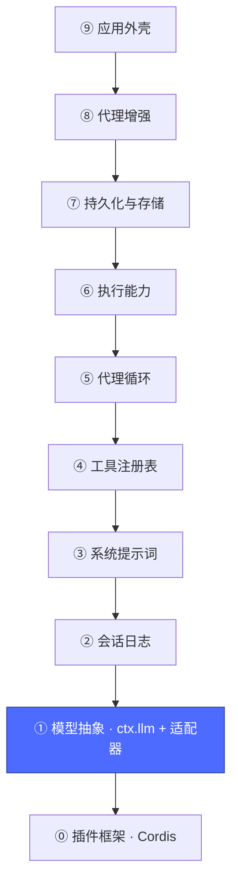
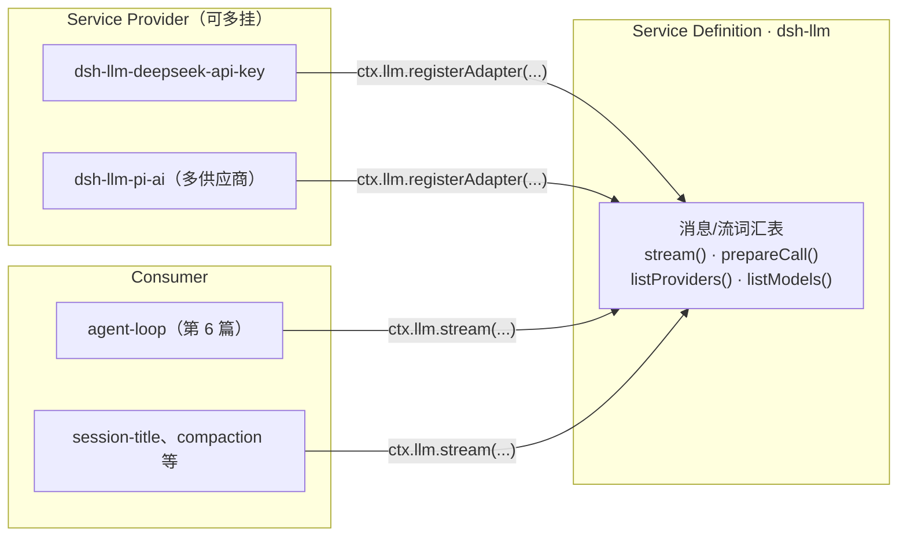

# 02 · 模型抽象层：`ctx.llm`

上一篇：[01 · 插件框架](01-插件框架.md) · 下一篇：[03 · 会话日志层](03-会话日志.md)



## 为什么第一层是它

裸框架里没有任何"智能"的来源。要加的第一块积木就是调用大模型的能力——但模型供应商是系统里**最易变**的部分（DeepSeek、OpenAI、Anthropic、本地模型……），所以这一层被设计成一个标准的**能力缝隙（seam）**，三个角色缺一不可：



对应包：[`packages/llm/llm`](../packages/llm/llm/README.md)（定义）、[`packages/llm/llm-deepseek-api-key`](../packages/llm/llm-deepseek-api-key/README.md)（提供方之一）。

## 核心机制

**适配器注册**（提供方侧）：

```ts
ctx.llm.registerAdapter(['deepseek-official'], adapter)
// 重复路由抛 DUPLICATE_ADAPTER；返回的句柄自带 disposer（注册即 effect）
```

**一次调用**（消费方侧）：`ctx.llm.stream(options)` 发起一次流式请求；每次流以唯一的 `finish` 块终结。消费方写的是统一的消息词汇表，**适配器负责翻成各家的 wire 格式**。

**两个事件**把这一层接进框架：

| 事件 | 模式 | 用途 |
|---|---|---|
| `llm/stream` | waterfall | 每次派发前过一遍——重试、日志、限速等策略都挂这里 |
| `llm/adapters-updated` | emit | 注册表变了，消费方重读（如 Web 的模型选择器） |

`dsh-llm-retry` 就是挂在 `llm/stream` 上的一个普通插件：包装下游、失败重试。它不改 `dsh-llm` 一行代码——这是"策略走事件、能力走服务"的第一次示范。

## 换供应商 = 改一行配置

因为消费方只认 `ctx.llm` 这个键名，把整个产品从 DeepSeek 官方切到另一套供应商，操作是在组合文件里换掉适配器那一行——agent 循环、工具、UI 全部无感。这就是第 1 篇"按键名消费"承诺的兑现。

## 动手

```sh
# 在真实组合树里找到这一层的两行（定义 + 提供方）
pnpm dsh --profile headless --dump-config | grep -A2 "^- id: llm"
# - id: llm
#   name: '@deepseek-ai/dsh-llm'
# - id: deepseek-llm-api-extensions ...

pnpm dsh --profile headless --dump-config | grep -A2 "^- id: llm-deepseek"
# - id: llm-deepseek
#   name: '@deepseek-ai/dsh-llm-deepseek-api-key'
```

**思考题**：`sdk-minimal` 的 `llm-deepseek` 行里写着 `apiKeyEnv: DEEPSEEK_API_KEY`——密钥为什么按"环境变量引用"而不是内联在配置里？（提示：配置是可能被快照、被分享的；而凭据有自己的子系统，第 7~8 篇附近。）

至此我们有了"能调模型"的世界，但模型还没有记忆——每次调用都是无状态的。下一层给它加上会话历史。

下一篇：[03 · 会话日志层](03-会话日志.md)
