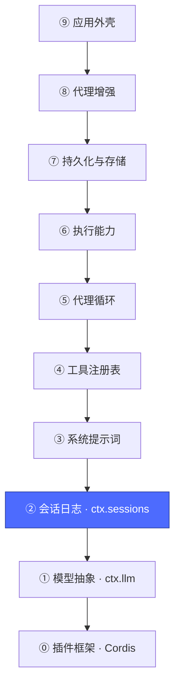
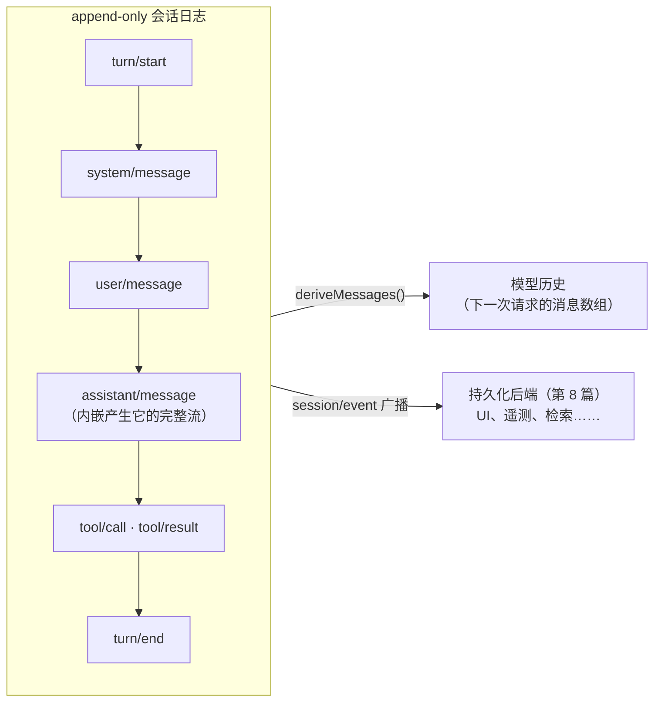

# 03 · 会话日志层：`ctx.sessions`

上一篇：[02 · 模型抽象层](02-模型层.md) · 下一篇：[04 · 系统提示词层](04-系统提示词.md)



## 为什么需要它

模型调用是无状态的——多轮对话的"记忆"必须自己维护。这一层的答案是**事件溯源**：不存"当前对话状态"，而是把会话中发生的每件事作为不可变事件追加进日志；模型历史只是日志的一个**投影**。

对应包：[`packages/core/session`](../packages/core/session/README.md)。注意它的定位：本体**从不调用模型**，只管日志。

## 核心机制：一切皆事件，历史是投影



- 写入：`session.append(type, data)`；读取模型视角：`session.deriveMessages()`
- 创建/复用：`ctx.sessions.create(id, {meta})` / `get` / `list` / `fork(...)` / `flush(session)`
- 关键事件族：`user/message`、`assistant/message`、`tool/result` 等"面事件"（模型可见的事实），外加 `request/header`、`assistant/attempt` 等"日志态"（请求配置、失败/重试/取消的尝试记录）

## 全仓库最重要的一条不变量

> **模型可见 ⟺ 已落日志（model-visible means logged）。**

任何进入模型请求的内容，都必须能从会话日志重建出来。这条不变量有运行时检查（`dsh-session/invariant`），它是后续一切能力的根基：

| 能力 | 为什么因此成立 |
|---|---|
| 断线恢复 / resume | 重放日志即可重建上下文 |
| fork（从某个回合分叉） | 日志前缀就是子会话的种子 |
| 持久化（第 8 篇） | 订阅 `session/event` 就有完整写入流 |
| 转录、审计、快照测试 | 日志是唯一事实来源 |

反过来，想给模型喂一种"新的输入"（比如图片、环境上下文），**第一步永远是先定义一种新的会话事件**——不能直接塞进请求里。

## 与上一层的关系

`dsh-session` 与 `dsh-llm` 互不依赖：日志不记得怎么调模型，模型层不记得有日志。把它们连起来的是第 6 篇的 agent-loop——它从日志投影历史、调用 `ctx.llm`、把结果写回日志。**每层只守自己的职责，组合发生在更高的层。**

## 动手

```sh
# 这一层在组合树里就是两行（定义 + DeepSeek 会话格式扩展）
pnpm dsh --profile headless --dump-config | grep -A2 "^- id: session"
# - id: session
#   name: '@deepseek-ai/dsh-session'
```

想直观感受事件日志长什么样：若有 `DEEPSEEK_API_KEY`，跑一次 `pnpm dsh --profile headless "说一句话"`，然后查看 `$DSH_HOME/sessions/<id>/` 下的 JSONL 文件——每一行就是上图里的一个事件（第 8 篇会讲这个文件由谁写入）。

现在模型有记忆了，但还缺一样东西：告诉模型"你是谁、你能做什么"的系统提示词。

下一篇：[04 · 系统提示词层](04-系统提示词.md)
