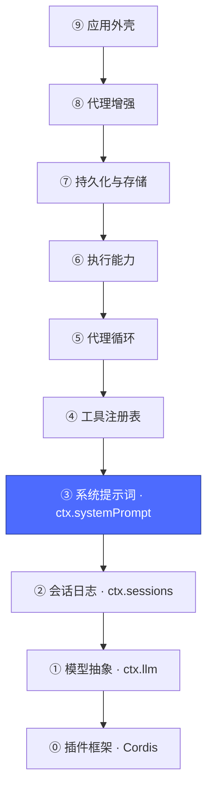
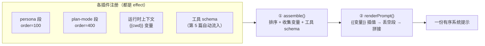
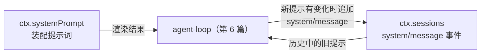

# 04 · 系统提示词层：`ctx.systemPrompt`

上一篇：[03 · 会话日志层](03-会话日志.md) · 下一篇：[05 · 工具注册表层](05-工具注册表.md)



## 为什么需要它

一个 Agent 的系统提示词不是一段写死的字符串，而是**几十个插件各贡献一段**的协作产物：人格、工作目录、计划模式规则、工具说明、技能清单……如果由某个中心模块拼接，每加一个功能都要改它——违背"一切皆插件"。这一层把提示词变成一个**注册表 + 装配管线**。

对应包：[`packages/core/system-prompt`](../packages/core/system-prompt/README.md)。

## 核心机制：分段注册，两阶段装配



- **section**：`ctx.systemPrompt.section({ name, order, text })`，按 `order` 升序拼接；`complete: true` 的段独占整份提示（至多一个）。
- **variable**：`ctx.systemPrompt.variable('cwd', ({agent}) => ...)`，文本里的 `{{cwd}}` 在渲染时插值。
- **作用域**：经 `agent.ctx` 注册的段只影响那一个 agent，并遮蔽同名全局段——"给某个会话换人格"不需要改全局。
- **事件**：`system-prompt/assemble`（waterfall，可按作用域过滤地改写装配结果）、`system-prompt/change`（注册表变更通知，驱动缓存失效）。

## 一个真实例子：plan-mode 就是一行配置

第 0 篇的减法清单里有这样一行（[packages/bundle/base/cordis.patch.yml](../packages/bundle/base/cordis.patch.yml)）：

```yaml
- id: plan-mode
  name: '@deepseek-ai/dsh-plan-mode'
  config:
    section: |
      You are in plan mode. Stay in plan mode until exit_plan_mode succeeds ...
```

整个"计划模式"对提示词的影响，就是这个插件挂了一段高优先级的 section。进入/退出计划模式 = 挂载/卸载这段文本（effect 回滚），提示词装配器本身毫无感知。

## 与前两层的关系



装配结果不会"悄悄进请求"——按第 3 篇的不变量，它以 `system/message` 事件落日志，模型可见的历史里永远包含当前生效的提示。

## 动手

```sh
# 找到这一层，并看看 headless 给它配了什么人格
pnpm dsh --profile headless --dump-config | grep -A4 "^- id: system-prompt"
# - id: system-prompt
#   name: '@deepseek-ai/dsh-system-prompt'
#   config:
#     personaSuffix: Your working directory is {{cwd}}.
#     personaPrefix: You are a coding agent powered by the {{model}} model.
```

注意 `{{model}}` 和 `{{cwd}}`——就是上面说的变量插值。

记忆和人格都有了，但 Agent 还不会"做事"。下一层给它加上手脚：工具。

下一篇：[05 · 工具注册表层](05-工具注册表.md)
