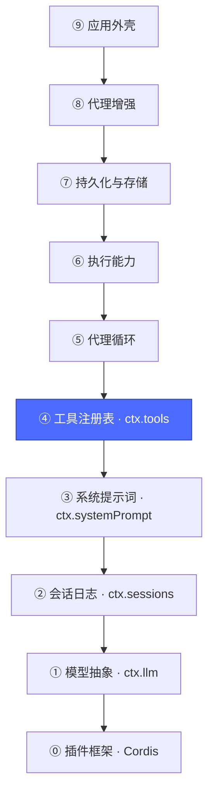
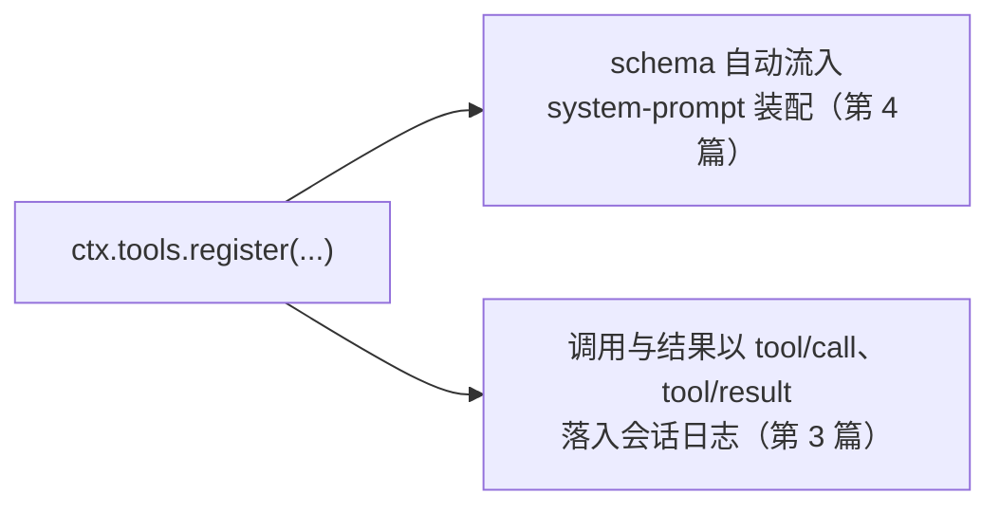
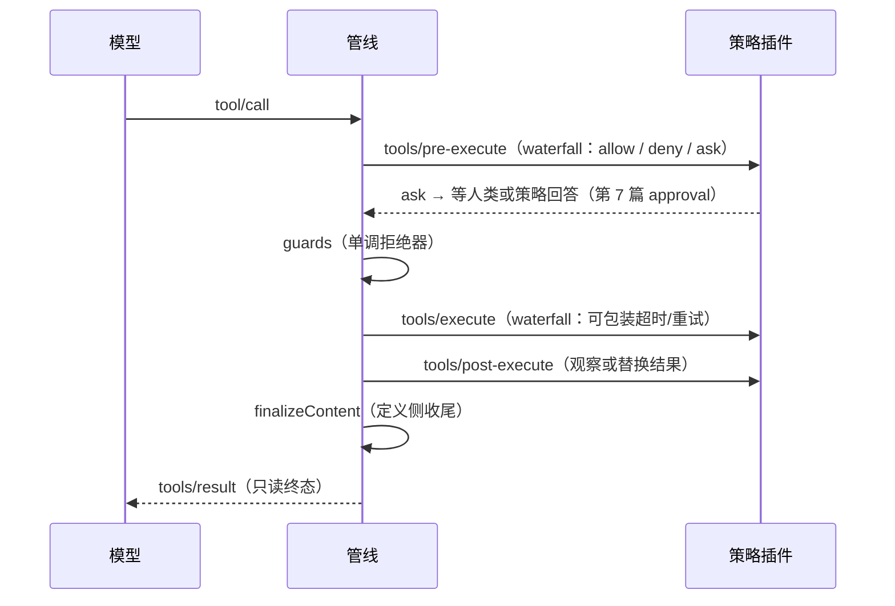

# 05 · 工具注册表层：`ctx.tools`

上一篇：[04 · 系统提示词层](04-系统提示词.md) · 下一篇：[06 · 代理循环层](06-代理循环.md)



## 为什么需要它

模型本身只会输出文本；"工具"是它改变世界的唯一通道。这一层提供：① 一个类型化注册表，工具注册即对模型可见；② 一条**固定的执行管线**，让所有策略（审批、超时、修剪、重试）有统一的挂点。

对应包：[`packages/core/tools`](../packages/core/tools/README.md)。

## 注册一个工具

```ts
ctx.tools.register(defineTool({
  name: 'read_file',
  description: '读取本地文件',
  parameters: Schema.object({ path: Schema.string() }),
  output: Schema.string(),
  async execute(args, exec) {
    return await readFile(args.path, 'utf8')
  },
}))
```

注册返回 disposer（又是 effect：插件卸载，工具立刻从模型视野消失）。两个自动发生的联动：



## 核心机制：五段执行管线

每次模型发起工具调用，固定走这条管线（模式标注在箭头上）：



整条管线**不需要 agent-loop 参与编排顺序**——顺序是注册表自己的契约。这就是为什么 timeout-policy、tool-result-pruner、repeat-tool-reminder 这些增强包（第 9 篇）都是"即插即用"的：它们只是往 `tools/execute`、`tools/post-execute` 上各挂了一个监听器。

注册表还提供 `restrict(filter)`（给某个 agent 收窄可见工具集）、`guard(...)`（单调拒绝）、`presentAs(mode)`（工具以何种呈现模式进 schema）。

## 小结：五层已齐

| 层 | 服务 | 职责 |
|---|---|---|
| ① | `ctx.llm` | 调模型 |
| ② | `ctx.sessions` | 记历史 |
| ③ | `ctx.systemPrompt` | 装配提示词 |
| ④ | `ctx.tools` | 注册并执行工具 |

四块积木互不直接依赖，静静躺在 `ctx` 上等待。下一篇登场的是把它们拧成一台机器的角色——**代理循环**。

下一篇：[06 · 代理循环层](06-代理循环.md)
