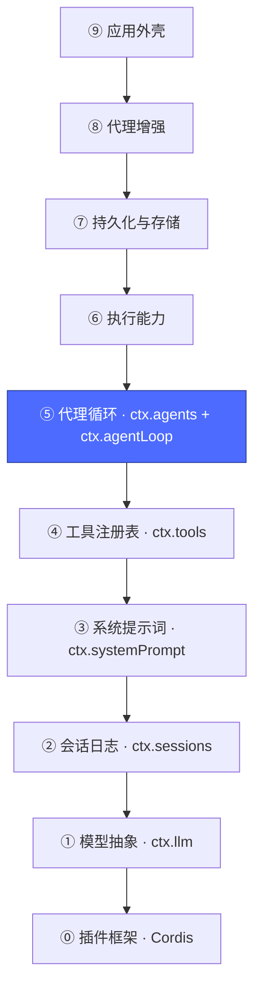
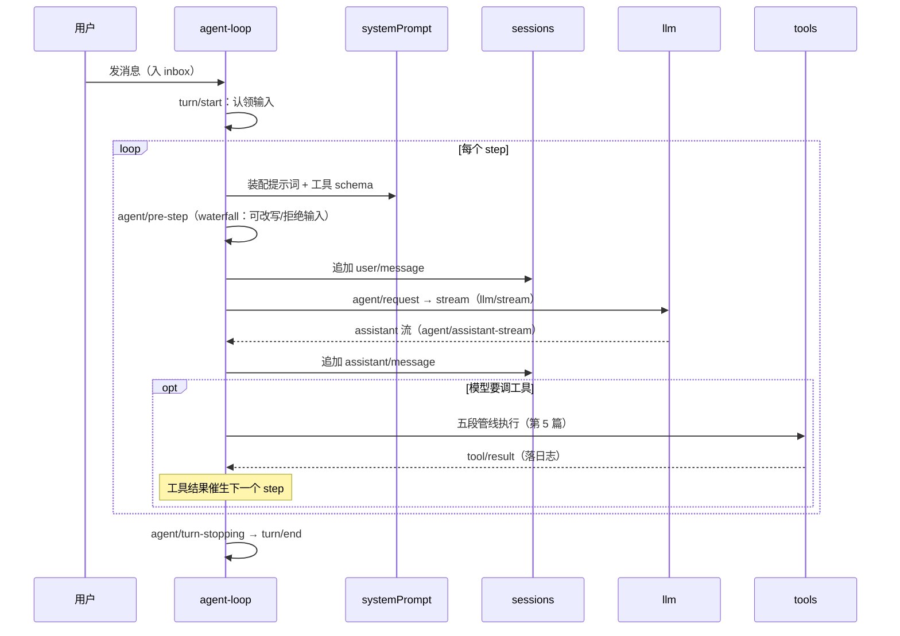
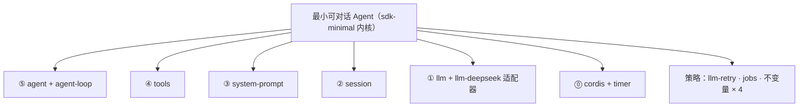

# 06 · 代理循环层：`ctx.agents` + `ctx.agentLoop`

上一篇：[05 · 工具注册表层](05-工具注册表.md) · 下一篇：[07 · 执行能力层](07-执行能力.md)



**这是加法路线的中点里程碑：加到这一层，你就拥有了一个最小可对话 Agent。**

## 为什么拆成两个包

| 包 | 提供 | 职责 |
|---|---|---|
| [`core/agent`](../packages/core/agent/README.md) | `ctx.agents` | Agent 句柄、注册表（`create/resume/get/list`）、`agent.ctx` 作用域、全部 `agent/*` 事件词表。**自己不发模型请求**——它定义"Agent 是什么"，把"怎么驱动"留给注册的 `AgentFactory` |
| [`core/agent-loop`](../packages/core/agent-loop/README.md) | `ctx.agentLoop` | 出厂的唯一 `AgentFactory`：把前四层拧成 turn/step 状态机 |

拆开的好处：UI、SDK、子代理都只跟 `ctx.agents` 的句柄打交道，不关心驱动者是谁；理论上换一个驱动实现（比如接入另一个产品的循环）不需要动任何消费者。

## 核心概念：turn 与 step

- **step** = 一次模型请求 + 它引发的工具调用。
- **turn** = 零或多个 step：从"认领输入"开始，到"不再欠任何东西"结束（文本回完、工具结果也回完）。



注意每一步的写日志动作——这就是第 3 篇"模型可见 ⟺ 已落日志"的执行者。取消是协作式的：已流出的文本保留，日志留下取消原因。

## 加法中点：盘点最小内核

把第 0 篇 `sdk-minimal` 的内核行按层归档，就是我们一路加上来的东西：



全部约 15 行插件。剩下的 SDK 服务器、bash 工具、持久化，都是⑥~⑨ 层的故事。

## 动手

```sh
# 找到这两个包在真实组合树里的行
pnpm dsh --profile headless --dump-config | grep -A3 "^- id: agent-loop"
# - id: agent-loop
#   name: '@deepseek-ai/dsh-agent-loop'
#   config:
#     agents: []        ← 启动时预创建的 agent；base 留空，由入口按需创建

# 真实对话（可选，需要 DEEPSEEK_API_KEY）：
pnpm dsh --profile headless "用一句话介绍你自己"
```

如果有密钥，跑完后对照第 3 篇的方法打开 `$DSH_HOME/sessions/<id>/session*.jsonl`，逐行读出 `turn/start → user/message → assistant/message → turn/end`——序列图里的每一步都在文件里。

最小 Agent 已经成立，但它还"手无缚鸡之力"：没有执行命令、读写文件的能力。下一层把整个执行世界给它。

下一篇：[07 · 执行能力层](07-执行能力.md)
