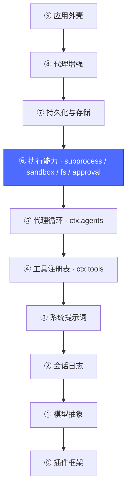
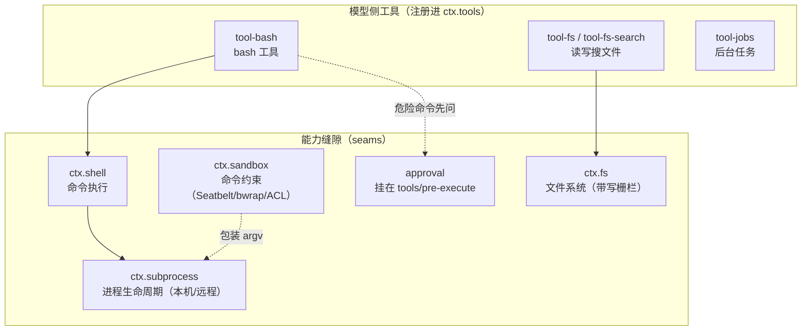
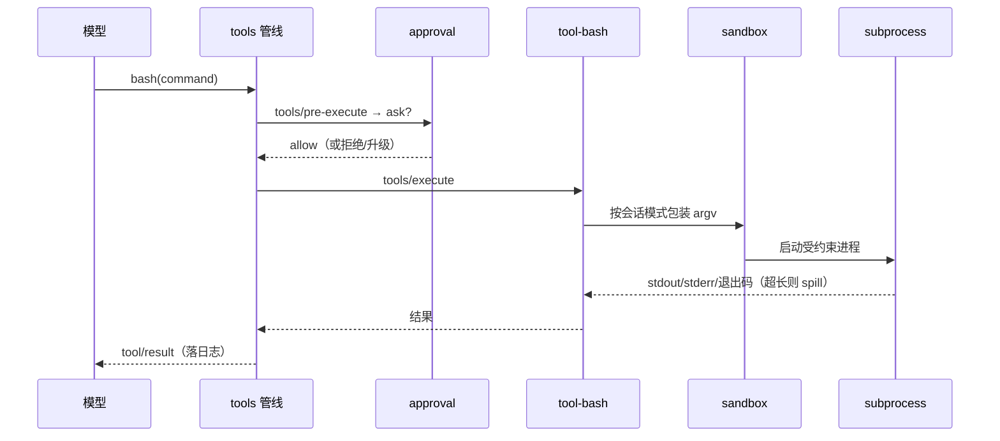

# 07 · 执行能力层：subprocess / sandbox / fs / approval

上一篇：[06 · 代理循环层](06-代理循环.md) · 下一篇：[08 · 持久化与存储层](08-持久化与存储.md)



## 为什么这一层是一"束"而不是一"个"

第 5 篇说工具是模型改变世界的通道——但 `bash` 工具真正干活时，要穿过一组能力：起进程、圈权限、读写文件、问人类同不同意。这些能力彼此咬合，共享**同一个执行世界**：



关键设计：**文件系统和子进程共享一个执行世界**。把 `ctx.subprocess` / `ctx.fs` 的提供方一起换成远程沙箱实现，`bash`、持久终端、LSP 会**全部跟着搬走**——不需要为任何工具写"远程版"。这就是 seam 的威力，也是 base 里 `subprocess`、`sandbox`、`fs-sandbox` 各自只占一行却能全局生效的原因。

## 各角色一句话

| 包 | ctx 键 | 职责 |
|---|---|---|
| [`subprocess-local`](../packages/subprocess/subprocess-local/README.md) | `ctx.subprocess` | 本机进程提供方：可执行文件解析、托管进程组（systemd scope / Job / PGID）、node-pty、有界输出 + spill 文件 |
| [`sandbox-local`](../packages/sandbox/sandbox-local/README.md) | `ctx.sandbox` | 三平台命令约束后端；无可用 runner 时 fail-closed 报 `SANDBOX_UNAVAILABLE` |
| [`sandbox-policy`](../packages/sandbox/sandbox-policy/README.md) | `ctx.sandboxPolicy` | 会话级模式：`read-only` / `workspace-write` / `danger-full-access` |
| [`fs-sandbox`](../packages/fs/fs-sandbox/README.md) | `ctx.fs` | 写/编辑按会话模式加栅栏，拒绝抛 `FS_SANDBOX_DENIED` |
| [`tool-bash`](../packages/shell/tool-bash/README.md) | —（消费方） | 模型侧 `bash` 工具；`inject: [tools, shell, systemPrompt, shellEnv]` |
| [`user-approval`](../packages/interaction/user-approval/README.md) | approval | `tools/pre-execute` 上回答 `ask`：问人，或被策略代答 |

## 一次 `bash` 调用的完整旅程



## 动手

```sh
# 执行层在组合树里的行（macOS 上 pwsh 两行是禁用的）
pnpm dsh --profile headless --dump-config | grep -A2 "^- id: sandbox"
pnpm dsh --profile headless --dump-config | grep -A5 "^- id: permission"

# 把权限模式切成只读，观察 sandbox-policy 的 config 变化（不改任何代码）
printf -- '- id: sandbox-policy\n  config:\n    mode: read-only\n    workspaceRoot: !!js process.cwd()\n' > /tmp/ro.yml
pnpm dsh --profile headless --patch /tmp/ro.yml --dump-config | grep -A3 "^- id: sandbox-policy"
```

Agent 现在能动手干活了。但进程一退，一切归零——下一层让会话活下来。

下一篇：[08 · 持久化与存储层](08-持久化与存储.md)
