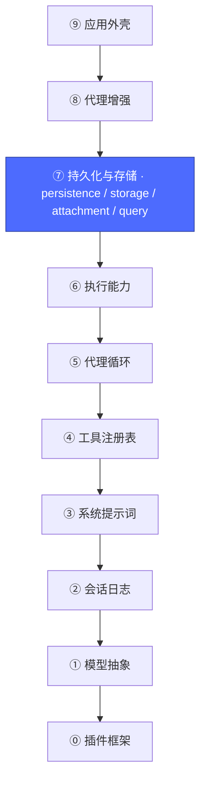
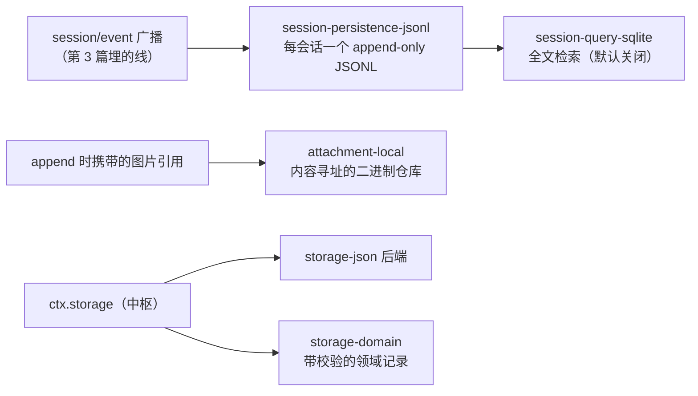

# 08 · 持久化与存储层

上一篇：[07 · 执行能力层](07-执行能力.md) · 下一篇：[09 · 代理增强层](09-代理增强.md)



## 为什么需要它

第 3 篇的会话日志目前只在内存里。进程退出，对话蒸发。这一层回答四个问题：会话存哪、非会话数据（设置、工作区元数据）存哪、图片等二进制存哪、历史会话怎么检索。

## 四块拼图



| 包 | 职责 |
|---|---|
| [`session-persistence-jsonl`](../packages/session/session-persistence-jsonl/README.md) | 实现 `ctx.sessionPersistence`：订阅 `session/event`，每会话落一个 JSONL 文件（默认 zstd 帧）；自带历史格式迁移、撕裂尾恢复、单写者锁 |
| [`storage`](../packages/storage/storage/README.md) | `ctx.storage` 中枢 + `ctx.storageDomain`：非会话类持久数据的注册与校验读写，**模型完全不可见** |
| `attachment-local` | 图片字节存日志外；消息里只留内容寻址引用，请求时按需解析 |
| `session-query-sqlite` | 会话检索；`openAt: never` 时只保留精确读取，不建索引 |

## 关键设计纪律

1. **持久化是纯消费者。** 它订阅 `session/event` 写入流——日志层（第 3 篇）不知道持久化的存在。换一个后端（SQLite、云端）只是换一个订阅者，agent 循环无感。
2. **已提交的文件代际永不改写。** JSONL 只追加；格式升级是"在旁边发布一个新的版本代际"，旧文件原地保留。所以磁盘上可能同时看到 `session.jsonl`（v0）和 `session.v2.jsonl`。
3. **二进制不进日志。** 图片按内容寻址存到附件仓库，日志只记引用——日志保持小巧且可重放。

## 动手

```sh
# 找到持久化行，注意 root 用 !!js 表达式指向 Harness 家目录
pnpm dsh --profile headless --dump-config | grep -A3 "^- id: session-persistence-jsonl"
# - id: session-persistence-jsonl
#   name: '@deepseek-ai/dsh-session-persistence-jsonl'
#   config:
#     root: !!js dshHomePath('sessions')

# 若跑过真实对话，直接看产物（每行一个事件，追加式）：
ls ~/.dsh/sessions/*/ 2>/dev/null | head
```

到这里，一个"能对话、能干活、能记住"的 Agent 已经完整。剩下两层是让它更强（⑧）和把它包装成产品（⑨）。

下一篇：[09 · 代理增强层](09-代理增强.md)
