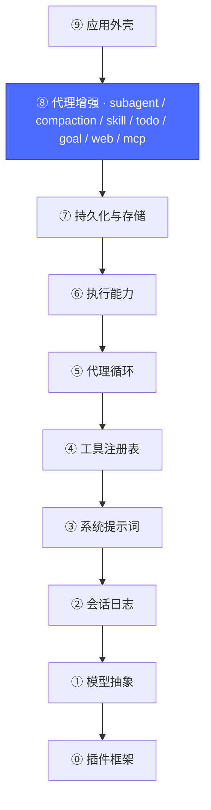
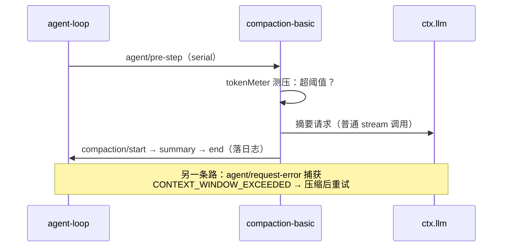
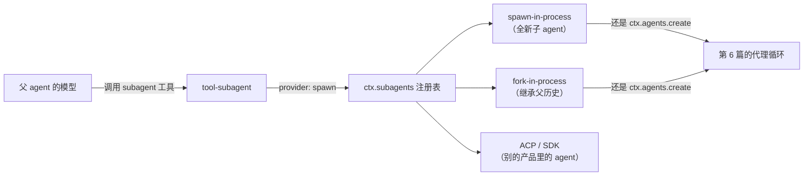

# 09 · 代理增强层：全是旧挂点的复用

上一篇：[08 · 持久化与存储层](08-持久化与存储.md) · 下一篇：[10 · 完整组装](10-完整组装.md)



## 这一层的秘密：没有新机制

学到第 6 篇时你已经见过了所有扩展点。第 8 层的每一个"高级功能"，拆开看都只是**前面学过的挂点的组合**：

| 增强 | 它实际挂在哪 |
|---|---|
| `compaction-basic`（上下文压缩） | `agent/pre-step` 监听器（用 `ctx.tokenMeter` 测压）+ `agent/request-error` 监听窗口溢出 + `ctx.llm.stream()` 做摘要 |
| `subagent`（子代理委派） | `ctx.subagents` 命名 provider 注册表（新 seam）+ `tool-subagent` 注册一个普通工具 |
| `skill`（技能加载） | 文件系统读取（⑥）+ 提示词 section（③）+ `tool-skill` 工具（④） |
| `todo` / `goal` / `plan-mode` | 各注册工具（④）+ 提示词 section（③）+ 会话事件（②） |
| `web`（搜索/抓取） | `ctx.web` 提供方 seam + `tool-web` 工具 |
| `jobs`（后台任务） | `ctx.jobs` 注册表 + `bash` 的 `run_in_background` 参数 + `tool-jobs` |
| `mcp`（外部工具） | 连接外部 MCP server，把它们的工具注册进 `ctx.tools` |

## 两个例子看穿它

**例子一：compaction（自动压缩）**——三个监听器 + 一次模型调用：



**例子二：subagent（子代理）**——父 agent 的一个工具，背后是 provider seam：



子代理不是另一套系统——就是 `ctx.agents` 又创建了一个 agent，父子关系以 `subagent/descriptor`、`subagent/catalog` 事件落日志（还是第 3 篇的规矩）。

## 动手：把这一整层卸下来

本资料已备好 overlay 文件 [examples/03-overlays/subtract.yml](examples/03-overlays/subtract.yml)，它禁用了 subagent / compaction / skill / goal / plan / web / workflow 共 26 行：

```sh
# 打上减法补丁后的禁用行数
pnpm dsh --profile headless \
  --patch learn/examples/03-overlays/subtract.yml \
  --dump-config | grep -c 'disabled: true'

# 对比：不打补丁时的禁用行数
pnpm dsh --profile headless --dump-config | grep -c 'disabled: true'
```

第一个数字会比第二个大——差值就是你亲手卸下的增强行数（macOS 上约为 26）。Agent 依然能对话、执行命令、记住会话，只是"不那么聪明了"。**这就是分层的意义：每一层都可以单独取舍。**

至此功能全部就位。最后一层回答：这 95 行插件是如何被"拼"成一个可启动产品的？

下一篇：[10 · 完整组装](10-完整组装.md)
