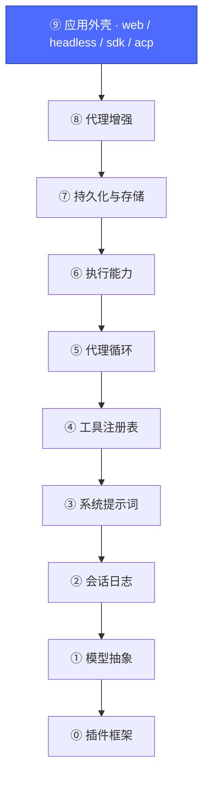
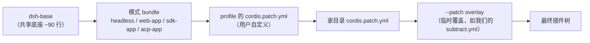
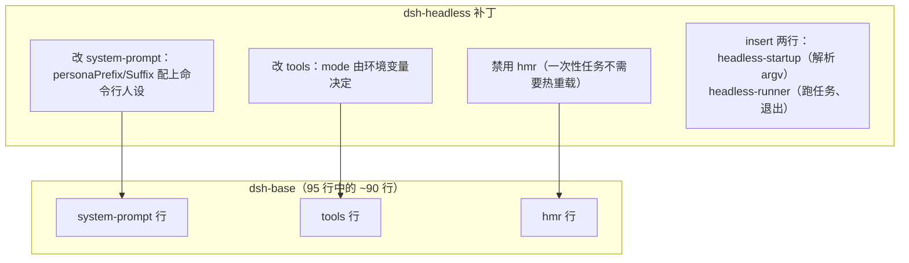
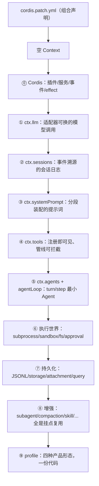

# 10 · 完整组装：bundle / profile / patch

上一篇：[09 · 代理增强层](09-代理增强.md) · [返回总览](README.md)



## 最后一块拼图：产品 = 有序的补丁层

前九篇解决了"有哪些插件"。这一篇回答"同一份代码如何变成四种产品"。三个名词：

- **bundle**：一组 `cordis.patch.yml` 行 + 它们挂载的代码的发行格式（一个 npm 包，用 `dsh.bundle` 字段自我声明）。
- **profile**：一份命名的组合，列出它叠加哪些 bundle，外加用户自己的补丁。官方发行 `web`、`headless`、`sdk`、`sdk-minimal`、`acp`。
- **patch（补丁）**：按 `id` 命中下层某行并**整体替换其 config**，或 `insert` 新行；也可 `disabled: true`。

启动一个空入口列表时，各层按序应用：



**后写胜出，且下层文件永不被改写**——所有定制都是账本上的注记。这就是第 0 篇"减法是禁用不是删除"的完整机制。

## 一个真实例子：headless = base + 三处改动

`headless` 模式 bundle 的全部内容（[packages/bundle/headless/cordis.patch.yml](../packages/bundle/headless/cordis.patch.yml)）：



四种外壳的差别就这么多：**web 加一个 HTTP 应用层，sdk 加一个 JSON-RPC 服务器，acp 加一个自动化桥，headless 加一个跑完即退的 runner**。而 `sdk-minimal` 是有意的例外——它不用 base，自己列全 32 行（第 0 篇见过的那棵小树）。

## 动手：看清每一层补丁

```sh
# dump 输出里的注释行直接标出了"哪一层改了哪一行"：
pnpm dsh --profile headless --dump-config | grep '^# =='
# # == @deepseek-ai/dsh-base
# # == @deepseek-ai/dsh-base, patched by @deepseek-ai/dsh-headless
# ...

# 自己当一回"模式 bundle"：禁用一行再观察
printf -- '- id: subagent\n  disabled: true\n' > /tmp/my-overlay.yml
pnpm dsh --profile headless --patch /tmp/my-overlay.yml --dump-config | grep -A2 '^- id: subagent$'
# - id: subagent
#   name: '@deepseek-ai/dsh-subagent'
#   disabled: true    ← 你的 overlay 生效了，base 文件一个字节没动
```

## 全链路回顾



回头看那句开场白：**Cordis 里一切皆插件，插件的一切注册都是可逆的。** 95 行的产品和 1 行的 hello-world 服从同一套物理——你现在拥有了全部九个概念。

## 继续深入

- 官方架构文档：[docs/architecture.zh.md](../docs/architecture.zh.md)
- 扩展食谱（往哪个挂点加新行为）：[docs/cookbook/extension-cookbook.md](../docs/cookbook/extension-cookbook.md)
- 添加工具/适配器/包的分步指南：[docs/cookbook/](../docs/cookbook/)
- Cordis 动手教程：[docs/cordis-tutorial/](../docs/cordis-tutorial/index.zh.md)

[返回总览](README.md)
