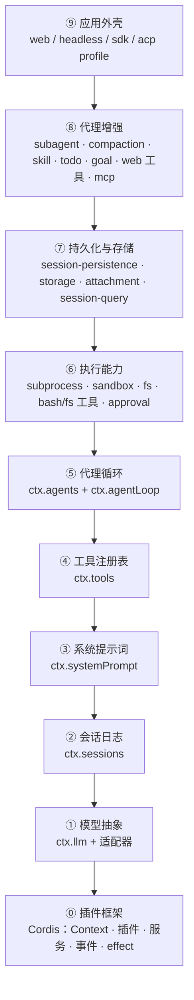

# 从插件框架到完整 Agent：DeepSeek Harness 分层学习路线

这份资料用一种"逆向工程"的方式帮你理解 DeepSeek Harness：

1. **先做减法** —— 把一个 95 行插件的完整产品一层层剥掉，直到只剩插件框架本身；
2. **再做加法** —— 从裸框架出发，一项功能一项功能地往上叠加，每一步都解释"为什么需要它、它挂在哪、它长什么样"；
3. **每一步都能动手验证** —— 要么是可以直接运行的小示例，要么是用 `dsh --dump-config` 观察真实产品的组合树。

> 这套文档放在仓库根目录的 `learn/` 下，是**学习笔记性质**的材料，不参与构建和测试门禁。
> 想要一篇不谈代码、用餐厅类比讲清同一套架构的科普读物，见隔壁 [popular/一家餐厅里的-Agent-框架.md](../popular/一家餐厅里的-Agent-框架.md)。

## 全景图：九层蛋糕

整个 Harness 没有一行"特权代码"——模型适配器、工具注册表、会话日志、甚至 Agent 循环本身，全都是挂在共享上下文（`ctx`）上的插件。把它们按职责分层后长这样：



读法：**箭头表示"建立在……之上"，不是加载顺序**。真实的激活顺序由服务依赖（`inject`）驱动——这是第 1 篇就会讲到的核心机制。

⑤ 层是一个重要里程碑：加到这一层，你就拥有了一个**最小可对话 Agent**（官方 `sdk-minimal` profile 就是这附近的形态，仅 32 行插件）。⑥~⑨ 层全是围绕它的能力与外壳扩展。

## 路线图

| 篇目 | 你将学到 | 对应包 |
|---|---|---|
| [00 · 减法：从完整产品到插件框架](00-减法.md) | 95 行插件如何剥到 0；为什么减到最后剩下的不是 `main()` | `vendor/cordis` |
| [01 · 插件框架](01-插件框架.md) | Context / 插件 / 服务 / inject / 五种事件 / effect | `vendor/cordis` |
| [02 · 模型抽象层](02-模型层.md) | `ctx.llm`、适配器 seam、`llm/stream` | `packages/llm/llm` |
| [03 · 会话日志层](03-会话日志.md) | `ctx.sessions`、事件溯源、"模型可见 ⟺ 已落日志" | `packages/core/session` |
| [04 · 系统提示词层](04-系统提示词.md) | `ctx.systemPrompt`、section/variable、两阶段装配 | `packages/core/system-prompt` |
| [05 · 工具注册表层](05-工具注册表.md) | `ctx.tools`、`defineTool`、五段执行管线 | `packages/core/tools` |
| [06 · 代理循环层](06-代理循环.md) | `ctx.agents` / `ctx.agentLoop`、turn/step、最小可对话 Agent | `packages/core/agent{,-loop}` |
| [07 · 执行能力层](07-执行能力.md) | `ctx.subprocess` / `ctx.sandbox` / `ctx.fs` / approval | `packages/{subprocess,sandbox,fs,shell}` |
| [08 · 持久化与存储层](08-持久化与存储.md) | JSONL 持久化、`ctx.storage`、附件、会话检索 | `packages/{session,storage,attachment}` |
| [09 · 代理增强层](09-代理增强.md) | subagent / compaction / skill / todo：全是旧挂点的复用 | `packages/{subagent,compaction,...}` |
| [10 · 完整组装](10-完整组装.md) | bundle / profile / patch 如何拼出四种产品形态 | `packages/bundle` |

## 三种动手方式

本资料的所有"动手"环节都不需要 API 密钥（真实对话除外，会标注）：

```sh
# 方式一：运行纯框架小示例（无需密钥）
cd learn/examples/01-bare-framework
node --import tsx ../../../vendor/cordis/bin.js

# 方式二：观察真实产品的插件组合树（无需密钥）
pnpm dsh --profile headless --dump-config

# 方式三：用 overlay 给真实产品"做减法"（无需密钥）
pnpm dsh --profile headless --patch learn/examples/03-overlays/subtract.yml --dump-config
```

前提：仓库已 `pnpm install`（你当前环境已就绪）。

## 开始之前只需要记住一句话

> **Cordis 里一切皆插件，插件的一切注册都是可逆的。**
> 减法之所以可行，是因为每一层都能干净地卸下；加法之所以安全，是因为每一层都通过声明好的缝隙（seam）挂上去。

下一篇：[00 · 减法：从完整产品到插件框架](00-减法.md)
